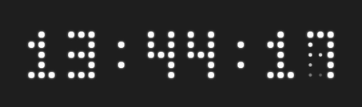
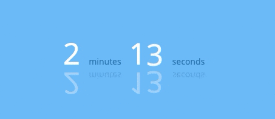
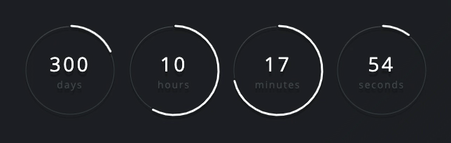

# Tick Counter

A ticker for declaritive building of countdowns and counters.

Supports:

- Counting towards a date
- Counting up from a date
- Scheduling multiple intervals
- Polling a value from a server
- Presenting a simple value

Some examples:







You can also use Tick to create [Flip counters](https://pqina.nl/flip/)

Made with ❤ By [Rik Schennink](https://twitter.com/rikschennink/)


## Setup

For now, see [example implementation](./example)


## Docs

Information on how to customize Tick and use the Tick API can be found on the [product website](https://pqina.nl/tick/).


## Tutorial

Building Tick Counters is very similar to building with Legos. Open the [example implementation](./example), clear the existing example, and follow along.

Start with the base `.tick` block:

```html
<div class="tick">

</div>
```

We haven't yet entered a value so we won't see anything on the screen.

Let's do that now, add a value using the `data-value` attribute.

```html
<div class="tick"
     data-value="50">

</div>
```

Tick now automatically adds a plain `"text"` view to present our value.

We can also present strings instead of numbers.

```html
<div class="tick"
     data-value="Hello World">

</div
```

This is useful but not very spectacular, let's do something more interesting. We'll switch back to numbers and setup a "line" progress counter.

We tell Tick to render a different view by adding an HTML element with a `data-view` attribute. In this case the **line** view.


```html
<div class="tick"
     data-value="50">

    <span data-view="line"></span>

</div>
```

It does not show the set progress. Maybe it's because there's no room to render our **line** view. We'll replace the `span` element with a `div` to make it stretch the entire width of the demo area.

```html
<div class="tick"
     data-value="50">

    <div data-view="line"></div>

</div>
```

That wasn't it.

We don't see anything because **line** doesn't know its maximum value and therefor cannot determine what progress to show. We have to feed line a a value between `0` and `1`, where `0` is empty and `1` is full.

We can do this by telling it the maximum value. We'll add a [transform](http://pqina.nl/tick/#value-transforms) that calculates the value between `0` and `1` for a value in a certain range (in this case 0 and 100).

```html
<div class="tick"
     data-value="50">

    <div data-view="line" data-transform="fraction(0,100)"></div>

</div>
```

There we go! We put in a value of 50 and the **fraction** transform turns it into **0.5**

Let's update our counter each second so we can see the progress bar fill up. Bind a function to the `data-did-init` callback. We'll limit its value to a 100.

We'll also add a nice animation using the `spring` transform. See how we can pipe values from one transform to the other.

```html
<div class="tick"
     data-value="50"
     data-did-init="handleTickInit">

    <div data-view="line" data-transform="fraction(0,100) -> spring"></div>

</div>
<script>
function handleTickInit(tick) {

    // The Tick `interval` function is an easy way to quickly setup a timer
    Tick.helper.interval(function() {

        // We simply increase the value of our ticker each second
        if (tick.value < 100) {
            tick.value += 5;
        }
        else {
            tick.value = 0;
        }

    });

}
</script>
```

There you have it, a simple progress bar build with Tick.

[Read the documentation](https://pqina.nl/tick/) to take a deep dive into what's possible with Tick.


## License

MIT License, Enjoy!
